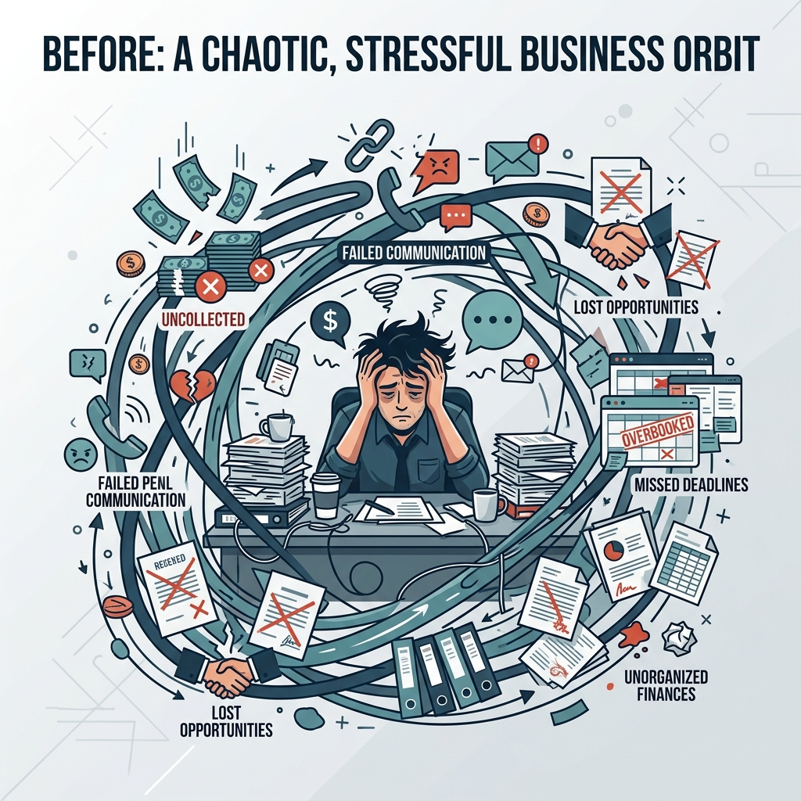
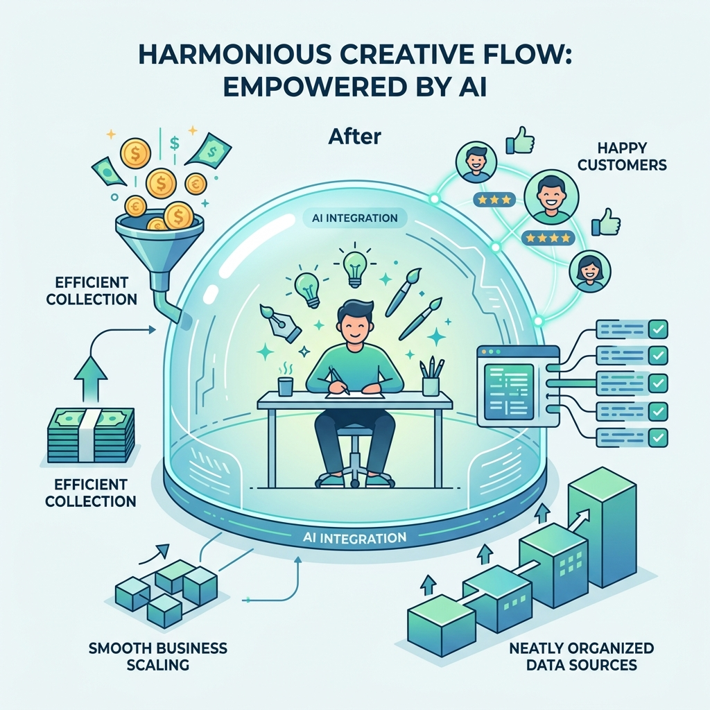

# DeniDin Product Vision

**To elevate professionals to their highest creative potential by freeing them to practice their pure craft, while an autonomous intelligence seamlessly handles the operational orbit of their business.**

## The Orbit Model

At the heart of every great business is a human being with a unique professional craft—whether they are a lawyer strategizing a complex case, an architect designing a building, or a consultant solving a critical problem. This is the **Core**.

### Before DeniDin
However, to sustain that Core, professionals are forced to maintain a heavy **Orbit** of secondary tasks. They become burdened by the sheer weight of administration, pulling them away from their true craft.

This orbit consists of:
- **Financial:** Accounting, fee structures, invoicing, and tax compliance.
- **Administrative:** Filing, regulatory compliance, and scheduling.
- **Client Communications:** Reminding clients of owed amounts, scheduling meetings, and onboarding.
- **Low-level Execution:** Generating initial document drafts, retrieving industry precedents (e.g., Mishpat-net integrations), or analyzing receipts.

The impact of this unmanaged orbit is severe:
- Customer management slips and money goes uncollected or dropped.
- Deals are missed due to administrative inefficiency.
- The business cannot grow because the orbit is suffocating and time-consuming.
- Data sources are missed and important meetings slip through the cracks.
- The human professional is over-worked, stressed, and fatigued.

### After: The DeniDin Layer

DeniDin exists to completely absorb the Orbit. 

By wrapping the professional in an omnipresent, autonomous AI layer accessible through natural conversation (WhatsApp), DeniDin ensures that the human remains entirely focused on their Core craft. The professional never has to step into the Orbit themselves; they simply interact with DeniDin to command, steer, and oversee the machinery of their business.

DeniDin is not just a chatbot or a shortcut. It is the complete unbundling of a professional's true craft from the operational burden of running a business.

The impact of the DeniDin layer is transformative:
- Customers are happy and money is collected timely.
- The business closes more deals, more efficiently.
- The business can scale effortlessly with more human helpers added directly to the inner core.
- Multiple data sources are seamlessly integrated; nothing is ever missed.
- The human professional is happy, refreshed, and creatively fulfilled.
